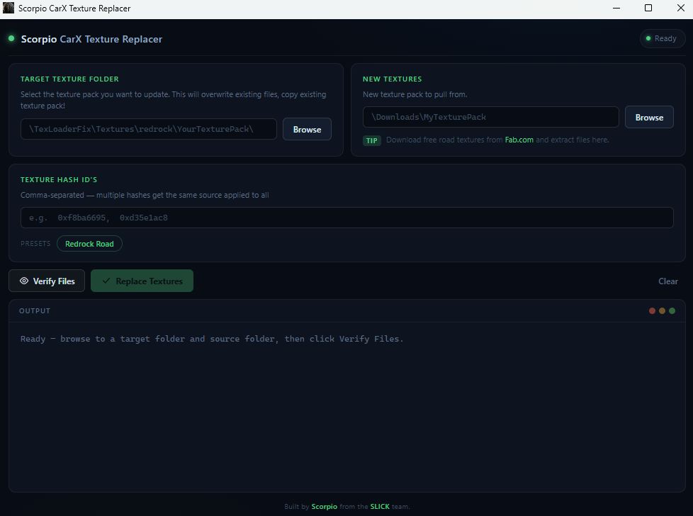

# Scorpio CarX Texture Replacer

A Windows desktop app for automating texture replacement in **CarX Drift Racing Online** mod texture packs.



> **This app is built primarily for use with [TexLoader CXFR](https://github.com/Silv3r25/TexLoader-CXFR/releases/tag/v2.2.2)** — a CarX mod that enables custom texture loading. You need TexLoader CXFR installed and set up before your replaced textures will appear in-game.

---

## Download

Grab the latest release from the [Releases](../../releases) page. Extract the zip and run `CarX TextureReplacer-win_x64.exe`.

> **Requirements:** Windows 10/11 with WebView2 (pre-installed on Windows 11, available via Windows Update on Windows 10).

---

## How to Use

### 1. Target Texture Folder
Click **Browse** and select the mod's texture folder — the one you want to update (e.g. `kino\mods\TexLoaderFix\Textures\redrock`).

> This folder will be overwritten. Make a backup copy of the texture pack before running.

### 2. New Textures
Click **Browse** and select the folder containing your new source textures (the ones you downloaded or created).

Source files are matched by their suffix patterns:

| Slot | Matched suffixes |
|------|-----------------|
| Base color | `_BaseColor`, `_Albedo`, `_Diffuse`, `_Color` |
| AO | `_AO`, `_AmbientOcclusion`, `_Occlusion` |
| Height | `_Displacement`, `_Height`, `_Disp` |
| Normal | `_Normal`, `_Nrm`, `_NormalMap` |

JPEG sources are automatically converted to PNG.

### 3. Texture Hash ID's
Enter the texture hash IDs (or file stem names) for the textures you want to replace, separated by commas.

**Example:**
```
0xf8ba6695, 0xd35e1ac8
```

Use the **Redrock Road** preset button to auto-fill the Redrock map road hashes.

### 4. Verify Files
Click **Verify Files** to scan and preview what will be replaced. The output panel shows:
- `✓` — file will be replaced
- `+` — new file will be created (3D mode)
- `✕` — file will be deleted (see Create as 3D Texture below)
- `⚠` — no matching source found, will be skipped

### 5. Replace Textures
Once the preview looks correct, click **Replace Textures** to apply all changes.

---

## Create as 3D Texture

When the target folder contains a simple (non-slotted) texture like `Road_1_new2.png`, a **Create as 3D Texture** toggle appears after scanning.

- **OFF** — replaces the existing file with the base color texture (standard 2D replacement)
- **ON** — deletes the original file and creates all four PBR slot variants:
  - `Road_1_new2_ao.png`
  - `Road_1_new2_base.png`
  - `Road_1_new2_height.png`
  - `Road_1_new2_normal.png`

> The original must be deleted because the game loads `Road_1_new2.png` with higher priority than `Road_1_new2_base.png`.

---

## Notes

- All output textures are forced to PNG format. Any existing `.jpg` slot files are replaced with `.png` and the old `.jpg` is removed.
- The app uses PowerShell's `System.Drawing` for image conversion — no third-party dependencies required.
- A debug log is written to `%TEMP%\tex_replacer_debug.log` during replacement.

---

*Built by Scorpio from the SLICK team.*
